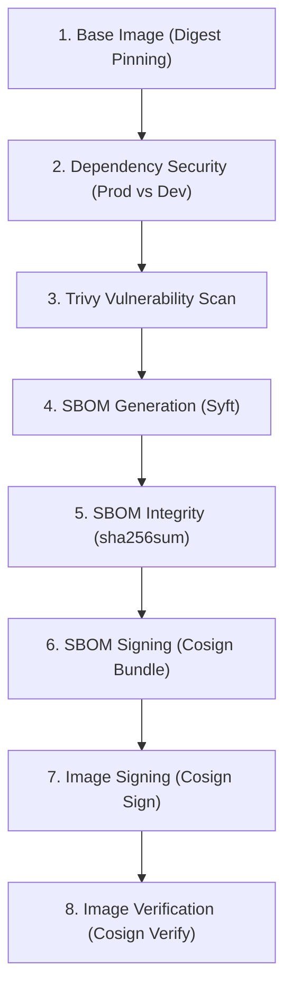

# 🛡️ Dokumentasi & Panduan Lengkap Supply-Chain Security Docker DevSecOps

Dokumen ini merangkum 8 pilar utama **Supply-Chain Security** yang telah diuji dan diterapkan pada proyek `FastAPI-CRUD-Application`.

---

## 🗺️ Diagram Alur Supply-Chain Security



---

## 1. Digest Pinning (Immutability Base Image)

* **Tujuan:** Mencegah serangan *upstream tag hijacking / mutation* dengan memastikan base image ditarik berdasarkan nilai checksum SHA-256 yang unik dan tidak berubah.
* **File Terkait:** `Dockerfile`

### Perintah Cek Digest & Implementasi:
```bash
# 1. Mengetahui SHA-256 digest dari image resmi:
docker inspect --format='{{index .RepoDigests 0}}' python:3.12-slim

# 2. Penulisan di Dockerfile:
ARG PYTHON_VERSION=3.12-slim
ARG PYTHON_SH=sha256:2199a62885a12290dc9c5be3ca0681d367576ab7bf037da120e564723292a2f0

FROM python:${PYTHON_VERSION}@${PYTHON_SH} AS base
```

---

## 2. Dependency Security & Minimization (Runtime vs Dev)

* **Tujuan:** Memisahkan dependensi *production/runtime* (`requirements.txt`) dan dependensi *development/test* (`requirements-dev.txt`) menggunakan Multi-Stage Build agar library seperti `pytest`, `httpx`, dan linter tidak mengotori image production.
* **File Terkait:** `requirements.txt`, `requirements-dev.txt`, `Dockerfile`, `compose.yaml`, `compose.dev.yaml`

### Perintah Pengujian & Verifikasi:
```bash
# 1. Uji resolusi dependensi tanpa menginstall (Dry Run):
docker run --rm python:3.12-slim pip install --dry-run -r requirements.txt

# 2. Build stage production:
docker compose build api

# 3. Verifikasi dependensi graph tidak ada yang konflik/rusak:
docker run --rm fastapi-crud-application-api:latest python -m pip check
# Output target: No broken requirements found.

# 4. Buktikan pytest TIDAK ADA di production image:
docker run --rm fastapi-crud-application-api:latest python -m pip show pytest
# Output target: WARNING: Package(s) not found: pytest
```

---

## 3. Vulnerability Scanning (Trivy)

* **Tujuan:** Mendeteksi celah keamanan (CVE) pada layer OS Debian dan library Python sebelum image container di-deploy.

### Perintah Trivy:
```bash
# 1. Scan celah keamanan tingkat HIGH dan CRITICAL:
trivy image --severity HIGH,CRITICAL fastapi-crud-application-api:latest

# 2. Scan hanya kerentanan yang sudah memiliki patch/fix resmi:
trivy image --severity HIGH,CRITICAL --ignore-unfixed fastapi-crud-application-api:latest

# 3. Simpan hasil scan ke file laporan (TXT / JSON):
trivy image --output scan-report.txt fastapi-crud-application-api:latest
```

---

## 4. Software Bill of Materials / SBOM (Syft)

* **Tujuan:** Membuat inventaris terstruktur dari seluruh pustaka, biner, lisensi, dan metadata komponen container dalam format standar industri (*CycloneDX*).
* **File Terkait:** `sbom.json`

### Perintah Pembuatan SBOM:
```bash
# 1. Membuat file SBOM format standar CycloneDX JSON:
syft fastapi-crud-application-api:latest -o cyclonedx-json=sbom.json

# 2. Melihat total komponen yang terdaftar di SBOM:
syft fastapi-crud-application-api:latest -o json | jq '.artifacts | length'
```

---

## 5. SBOM Integrity (Checksum Hashing)

* **Tujuan:** Mengunci file `sbom.json` dengan hash kriptografi SHA-256 agar integritas file dapat diaudit dari perubahan ilegal.
* **File Terkait:** `sbom.json.sha256`

### Perintah Pembuatan & Verifikasi Checksum:
```bash
# 1. Membuat file checksum sha256:
sha256sum sbom.json > sbom.json.sha256

# 2. Memeriksa isi nilai hash:
cat sbom.json.sha256

# 3. Memverifikasi integritas file SBOM:
sha256sum -c sbom.json.sha256
# Output target: sbom.json: OK
```

---

## 6. Digital Signing pada SBOM (Cosign Sign-Blob)

* **Tujuan:** Menandatangani file SBOM secara kriptografi menggunakan kunci privat (*private key*) developer untuk membuktikan keaslian pembuat (*provenance*).
* **File Terkait:** `cosign.key`, `cosign.pub`, `sbom.bundle.json`

### Perintah Signing & Verifying File (Blob):
```bash
# 1. Generate pasangan kunci Cosign (jika belum ada):
cosign generate-key-pair
# Menghasilkan: cosign.key (Private) dan cosign.pub (Public)

# 2. Tandatangani file SBOM ke format Sigstore Bundle:
cosign sign-blob --key cosign.key --bundle sbom.bundle.json sbom.json

# 3. Verifikasi keaslian SBOM dengan kunci publik:
cosign verify-blob --key cosign.pub --bundle sbom.bundle.json sbom.json
# Output target: Verified OK
```

---

## 7. Container Image Signing (Cosign Sign)

* **Tujuan:** Menandatangani image Docker secara langsung pada registry agar image terverifikasi sebelum ditarik (*pull*) atau dijalankan.

### Perintah Sign Image:
```bash
# 1. Jalankan local registry untuk pengujian/latihan:
docker run -d -p 5000:5000 --restart=always --name registry registry:2

# 2. Tag dan push image ke registry lokal:
docker tag fastapi-crud-application-api:latest localhost:5000/fastapi-app:latest
docker push localhost:5000/fastapi-app:latest

# 3. Tandatangani image container di registry:
cosign sign --key cosign.key --allow-insecure-registry localhost:5000/fastapi-app:latest
```

---

## 8. Container Image Verification (Cosign Verify)

* **Tujuan:** Memvalidasi tanda tangan digital image container sebelum ditarik (*pull*) atau dijalankan oleh orchestrator (Docker Compose / Kubernetes).

### Perintah Verify Image:
```bash
# Memverifikasi image di registry menggunakan public key:
cosign verify --key cosign.pub --allow-insecure-registry localhost:5000/fastapi-app:latest
```
> **Output target:** Menampilkan payload JSON claim bahwa tanda tangan valid (*"The cosign claims were validated"*).

---

## 🔒 Catatan Keamanan Tambahan
1. **Keamanan Private Key:** Pastikan file `cosign.key` sudah ditambahkan ke `.gitignore` dan tidak pernah di-commit ke repositori Git.
2. **Hardening Dockerfile:** Pastikan stage `production` di Dockerfile menghapus biner `pip` (`RUN rm -rf /usr/local/bin/pip...`) dan menjalankan container sebagai `USER appuser` (non-root).
